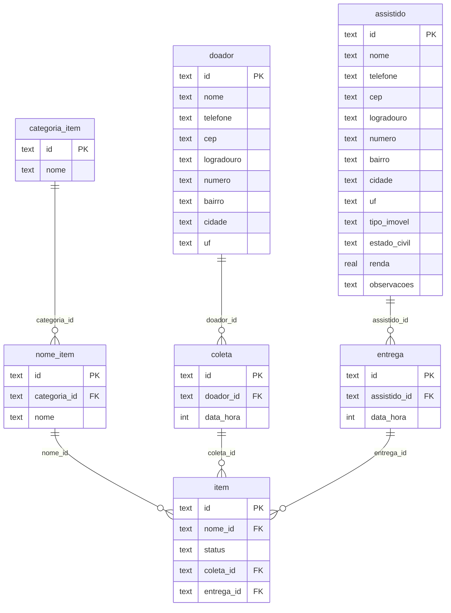

# Cortes de `modelos-db.md`

Seções removidas de [`../frozen/modelos-db.md`](../frozen/modelos-db.md) quando o
backend foi congelado para esta rodada. Não são o estado atual: são o histórico
de como o modelo chegou aqui e o esboço que o `schema.ts` substituiu.


## Regras de valor

As regras moram em um lugar só: o zod de `src/worker/db/schema.ts`, cada
`refinement` logo abaixo da tabela que ele julga. As regras viram `400` com o nome
do campo, não `409` do banco.

### Os `check()` foram removidos

O schema **teve** `check()` — 26 deles, em `efca2a7` — e não tem mais. A decisão
foi o contrário da intuição, e vale registrar o porquê:

- **A regra duplicada tem dois jeitos de falhar.** No `check()` a violação sobe
  como `500 INTERNAL_ERROR` — `handleApiError` só traduz `FOREIGN KEY` e
  `UNIQUE constraint`, então um `CHECK constraint failed` cai no `catch` genérico
  e o cliente recebe um erro interno, sem mensagem útil. No zod a mesma regra
  volta como `400 INVALID_VALUE` com o campo nomeado. Duas cópias da regra, dois
  formatos de erro, e o pior dos dois chegando ao cliente.
- **O zod já cobria tudo que a API consegue julgar.** Nome em branco, `>= 0`,
  formato de CEP e as listas de `enum` estão todas no schema, com a mensagem
  escrita para o usuário final.
- **O que o zod não alcança, o banco continua fazendo.** A `FOREIGN KEY` e o
  índice único do catálogo são constraints de verdade — não há como reescrevê-las
  em TypeScript — e continuam no DDL. Referência e unicidade não foram
  removidas: só deixaram de ter uma segunda cópia em `check()`.

O preço, aceito: **escrita que não passa pela API não é filtrada.** D1 Studio,
`npm run db-seed` e scripts futuros podem gravar `renda: -500` ou nome em branco
sem que nada recuse. E o `PATCH` tem duas brechas, que o `check()` cobria e o zod
não cobriu — ver [Onde não há garantia](#onde-não-há-garantia).

Uma consequência prática: `drizzle/migrations/20260926213838_lucky_karma`
ainda cria as constraints, porque uma migration já aplicada é imutável. O banco
local e o remoto já têm os `check()`, e um banco novo criado do zero também os
terá, até alguém rodar `npm run gen-drizzle` e `wrangler d1 migrations apply`
para a migration que os remove. O Drizzle não percebe isso sozinho: ele só vê a
diferença quando alguém manda gerar.

O que o Drizzle emite e o que não emite importa para não confiar no schema duas
vezes:

| No schema | No DDL | No zod |
|---|---|---|
| `text("status", { enum: [...] })` | nada | `z.enum([...])` |
| `text("uf", { enum: UFS })` | nada — só tipa o TS | `z.enum(UFS)` |
| `integer("aposentado", { mode: "boolean" })` | `integer` | `z.boolean()` |
| `text("doador_id").references(doador.id)` | `FOREIGN KEY` | nada — e é o banco quem julga |

### O que é garantido

| Regra | Tabela | Onde |
|---|---|---|
| `nome` não vazio e sem espaço nas pontas | `assistido`, `doador`, `categoria_item`, `nome_item` | `nomeNaoVazio` (`trim().min(1)`) |
| `email` com formato de e-mail | `assistido`, `doador` | `emailValido` |
| `cep` com 8 dígitos, sem hífen (é o que o ViaCEP devolve) | `assistido`, `doador` | `cepComOitoDigitos` |
| uma das 27 UFs | `assistido`, `doador` | `enum` da coluna |
| `ALUGADO` \| `PROPRIO` | `assistido` | `enum` da coluna |
| um dos 5 estados civis | `assistido` | `enum` da coluna |
| `renda >= 0` | `assistido` | `naoNegativo` |
| `valorAluguel >= 0` | `assistido` | `naoNegativo` |
| contadores de pessoas ≥ 0 | `assistido` | `naoNegativo` |
| um dos 3 status | `item` | `enum` da coluna |
| referência existe (doador, assistido, coleta, entrega, nome de item) | todas | `FOREIGN KEY` do D1, mapeado em `handleApiError` |
| `ENTREGUE` ⇒ `entregaId` preenchido | `item` | `validateItem` (`DELIVERY_REQUIRED`) |
| `AGUARDA_COLETA → EM_ESTOQUE → ENTREGUE` | `item` | `validateItem` (`INVALID_STATUS_TRANSITION`) |

Referência é o único caso em que o banco é o juiz, e é de graça: o D1 já
recusa a escrita pendurada, então a API não consulta nada antes de inserir. O
erro sobe como `D1QueryError`/`DrizzleQueryError` com o texto
`FOREIGN KEY constraint failed` na cadeia, e `handleApiError` o traduz —
`400 INVALID_REFERENCE` em `POST`/`PATCH`, `409 CONFLICT` em `DELETE`. O texto
do D1 não diz qual das seis chaves falhou, então a mensagem é genérica: uma
consulta antes da escrita traria o nome do campo, ao custo de uma leitura por
payload.

### Onde não há garantia

Uma regra tinha `check()` e foi removida com ele. O `PATCH` não consegue julgá-la,
porque o campo que decide é justamente o que o cliente não mandou:

- `entregaId` ⇒ `coletaId`: um item pode ficar apontando para uma entrega sem
  coleta, o que desfaz a fonte única de quem doou (ver
  [`item`](#item)). A `FOREIGN KEY` garante que a coleta existe, não que ela
  esteja lá.

Fechar qualquer uma das duas é uma linha em um `validateAssistido` — que ainda
não existe, só o `validateItem` está escrito — ou no `validateItem`: o
`validate` do `registerResource` já recebe a linha existente, que é o que
falta.

`tipoImovel` × `valorAluguel` deixou de ser regra: `PROPRIO` com
`valorAluguel` preenchido é aceito. Ela era o único `.refine()` que o zod não
conseguia escrever como qualificador nativo, porque é entre duas colunas. O
gerador de seed continua produzindo o dado coerente — aluguel só em `ALUGADO` —
mas a API não impede mais o par contraditório.

### Índices e `ON DELETE`

As tabelas de domínio não tinham índice nenhum além da PK, e o SQLite não cria
índice automático para FK. Hoje existem `nome_item_categoriaId_idx`,
`coleta_doadorId_idx`, `entrega_assistidoId_idx`, `item_status_idx`,
`item_coletaId_idx` e `item_entregaId_idx` — as colunas que filtram as telas de
lista. Quando a [#13](https://github.com/luiztosk/sistema-doacoes-2/issues/13)
entrar, o índice tem que começar por `organization_id`.

As 6 FKs de domínio declaram `on delete: "no action"` explicitamente: excluir um
doador que tem coleta estoura, e a API responde `409`. A mesma constraint é o que
recusa um `doador_id` que não existe, então é a única regra que o banco julga —
ver [Regras de valor](#regras-de-valor). Está escrito assim de propósito, para
não ficar implícito.

> A migration já aplicada (`20260926213838_lucky_karma`) **não emite** cláusula
> `ON DELETE` para as FKs de domínio — só para as do Better Auth, que usam
> `CASCADE`. Como migration é imutável, "não implícito" vale para o TypeScript e
> para o `snapshot.json`, mas no banco o comportamento é o default do SQLite.

O catálogo também tem unicidade: `categoria_item_nome_uniq` e
`nome_item_nome_uniq`, os dois sobre `lower(nome)`, para que "arroz 5kg" e
"Arroz 5kg" contem como o mesmo nome. Um `UNIQUE` na coluna seria case-sensitive
(a collation padrão do SQLite é BINARY) e é constraint de tabela — que o SQLite
só consegue adicionar reconstruindo a tabela. Um índice sobre `lower(nome)` é um
`CREATE UNIQUE INDEX` e não mexe nos dados. O seed não usa mais
`onConflictDoNothing()`: um nome repetido no catálogo estoura o `UNIQUE` e o
processo sai com código 1, em vez de pular a linha em silêncio.

### Triggers: não adicionados

Decisão registrada, não omissão. Os triggers foram avaliados e descartados:

- **Transição de status** (`AGUARDA_COLETA → EM_ESTOQUE → ENTREGUE`) já é
  validada em `validateItem` (`src/worker/api/v1.ts`), que responde `400`
  com o campo e a transição inválida. Um trigger seria uma segunda cópia
  independente da mesma regra, e o D1 levantaria a violação como erro de
  constraint genérico — resposta pior do que a de hoje, para o cliente.
- **Regras de valor** (`nome` em branco, `renda` negativa, `cep` fora de 8
  dígitos) dariam ao cliente exatamente a resposta que o trigger liftaria:
  `409` genérico, sem o campo. É a mesma razão que tirou o `check()` do schema —
  ver [Os `check()` foram removidos](#os-check-foram-removidos).
- **Uma das invariantes com dados sujos deixou de existir como possibilidade:**
  o destinatário vinha de uma coluna denormalizada no `item` que podia divergir
  da entrega (12 dos 44 itens divergiam). Com a coluna removida, o destinatário
  só tem uma fonte.

Se um dia o `db-seed` ou um script escrever direto no D1 precisar de uma regra
que o zod não alcança, o lugar certo é um trigger — e ele entra junto com um
mapeamento de erro, não sozinho.

### Pendente

- **Recriar a invariante no `PATCH`.** A brecha que sobrou, ver
  [Onde não há garantia](#onde-não-há-garantia).
- **Nome do campo na `INVALID_REFERENCE`.** O texto do D1 não diz qual das cinco
  chaves falhou, então a mensagem é genérica. Nomear exigiria voltar a consultar
  antes de escrever — que é o que o `FOREIGN KEY` eliminou de graça.
- **A migration que remove os `check()` no remoto.** As migrations foram
  regeradas sem eles e o banco local está limpo; falta aplicar no remoto. Ver
  [Os `check()` foram removidos](#os-check-foram-removidos).

### Feito: valores no zod

`createInsertSchema` da
[#42](https://github.com/luiztosk/sistema-doacoes-2/issues/42) infere de graça o
que a tabela já expressa — enum, boolean, required. O que o tipo não diz — `>= 0`,
texto não vazio, formato de CEP, formato de e-mail — entra por qualificadores
nativos do zod (`min`, `regex`, `z.email()`), passados como `refinement` na
geração do schema e escritos logo abaixo da tabela que eles julgam, ao lado dos
três schemas que os consomem — sem `check()` no banco e sem schema factory.

A escolha por qualificadores nativos tem um motivo além de estilo: o
[`#44`](https://github.com/luiztosk/sistema-doacoes-2/issues/44) demandou que o
gerador de dados consumisse estes schemas. Um `.refine()` vira um check opaco
que nenhuma ferramenta consegue ler, enquanto `min` e `regex` são
inspecionáveis. O `refinement` era o que impedia o seed de ser conferido contra
o schema.

## Diagrama ER



O diagrama mostra as **relações**, e não a lista completa de colunas: os
blocos de `assistido` e `doador` estão resumidos, e as 6 FKs de domínio
`assistido_id`, `doador_id`, `categoria_id`, `nome_id`, `coleta_id` e
`entrega_id` declaram `on delete: "no action"`. Para a lista completa, ver as
seções acima.

## Esboço do schema Drizzle (`src/worker/db/schema.ts`)

```typescript
import { sqliteTable, text, integer, real } from "drizzle-orm/sqlite-core";

// Os tres enums do arquivo sao `const` de modulo e nenhum deles e exportado,
// menos `UFS`.
const UFS = [
  "AC","AL","AP","AM","BA","CE","DF","ES","GO","MA","MT","MS","MG",
  "PA","PB","PR","PE","PI","RJ","RN","RS","RO","RR","SC","SP","SE","TO",
] as const;

const TIPOS_IMOVEL = ["ALUGADO", "PROPRIO"] as const;
const ESTADOS_CIVIS = [
  "SOLTEIRO","CASADO","DIVORCIADO","VIUVO","UNIAO_ESTAVEL",
] as const;

// Os 7 campos de endereco sao colunas soltas, como abaixo. Nao existe um
// objeto `endereco` compartilhado: `doador` lista os mesmos 7 um a um.
export const assistido = sqliteTable("assistido", {
  id: text("id").primaryKey(),
  nome: text("nome").notNull(),
  telefone: text("telefone"),
  email: text("email"),
  cep: text("cep"),
  logradouro: text("logradouro"),
  numero: text("numero"),
  complemento: text("complemento"),
  bairro: text("bairro"),
  cidade: text("cidade"),
  uf: text("uf", { enum: UFS }),
  tipoImovel: text("tipo_imovel", { enum: TIPOS_IMOVEL }),
  valorAluguel: integer("valor_aluguel"),
  estadoCivil: text("estado_civil", { enum: ESTADOS_CIVIS }),
  numeroAdultos: integer("numero_adultos"),
  criancasPequenas: integer("criancas_pequenas"),
  adolescentes: integer("adolescentes"),
  doentes: integer("doentes", { mode: "boolean" }),
  bolsaFamilia: integer("bolsa_familia", { mode: "boolean" }),
  aposentado: integer("aposentado", { mode: "boolean" }),
  pensao: integer("pensao", { mode: "boolean" }),
  cestaBasica: integer("cesta_basica", { mode: "boolean" }),
  atividadeRemunerada: integer("atividade_remunerada", { mode: "boolean" }),
  renda: real("renda"),
  criancaEscola: integer("crianca_escola", { mode: "boolean" }),
  observacoes: text("observacoes"),
});

export const item = sqliteTable(
  "item",
  {
    id: text("id").primaryKey(),
    nomeId: text("nome_id")
      .notNull()
      .references(() => nomeItem.id, { onDelete: "no action" }),
    status: text("status", { enum: STATUS_ITEM })
      .notNull()
      .default("AGUARDA_COLETA"),
    coletaId: text("coleta_id").references(() => coleta.id, {
      onDelete: "no action",
    }),
    entregaId: text("entrega_id").references(() => entrega.id, {
      onDelete: "no action",
    }),
  },
  (t) => [
    index("item_status_idx").on(t.status),
    index("item_coletaId_idx").on(t.coletaId),
    index("item_entregaId_idx").on(t.entregaId),
  ],
);

// doador, categoria_item, nome_item, coleta, entrega: mesmo padrão.
```

O esboço acima omite os schemas de zod que julgam cada tabela e o
`export * from "./auth-schema"` — o arquivo real é `src/worker/db/schema.ts`.

## Diferenças em relação ao legado (PI I)

1. **Endereço separado** em 7 colunas (antes era um campo único `endereco`) —
   necessário para a integração com o ViaCEP (issue #16).
2. **Instituição = `organization` do Better Auth, mas sem isolamento ainda** —
   o legado tinha `instituicao` como tabela comum. A coluna `organization_id`
   existia em todas as tabelas de domínio e foi removida junto com a integração
   do Better Auth; volta com a
   [#13](https://github.com/luiztosk/sistema-doacoes-2/issues/13). **Enquanto ela
   não voltar, não há isolamento por tenant.**
3. **IDs em texto** em vez de inteiros — padrão do Better Auth.
4. **Sem tabelas `user`/`role` próprias** — autenticação fica com o Better Auth.
   O papel vive em `member.role`, que é um `text` sem constraint com default
   `'member'`; os valores usuais do Better Auth são `owner`, `admin` e `member`.
5. **Sem migração de dados reais** — os dados do legado são fictícios (mock);
   hoje eles são gerados por `src/worker/db/generate.ts`, e o catálogo vem do
   JSON em `mock_data/catalogo.json`.
6. **`item` sem `doador_id`/`assistido_id`** — o legado guardava uma cópia
   denormalizada do doador e do assistido no item. Quem doou e quem recebeu saem
   da coleta e da entrega; a cópia divergia do evento de origem.
