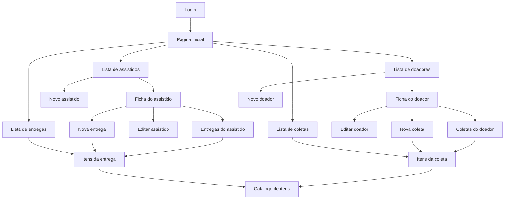

# Síntese dos fluxos de tela do PI I

## Conceitos usados na interface

- **Assistido:** pessoa ou família que recebe itens da instituição.
- **Doador:** pessoa que fornece itens à instituição.
- **Coleta:** entrada de uma doação, associada a um doador e a uma data/hora.
- **Entrega:** saída de itens, associada a um assistido e a uma data/hora.
- **Item:** unidade rastreável de um tipo de bem. Pode apontar para sua coleta de
  origem e para sua entrega de destino.
- **Nome do item/categoria:** catálogo usado ao incluir um item, por exemplo um
  tipo de roupa dentro de uma categoria.

## Mapa geral

O menu lateral permite saltar, a partir das telas internas, para as quatro
listas principais.

## Fluxo 1 — autenticação e navegação

1. Um usuário não autenticado é direcionado ao login.
2. Após autenticar, abre a página inicial.
3. O usuário escolhe uma das quatro áreas principais.
4. `Início` retorna à página inicial e `Sair` encerra a sessão.

**Evidência:** login e navegação são demonstrados no vídeo. Todas as rotas do
legado usam `auth_required()`. Autorização por papel não foi confirmada.

## Fluxo 2 — assistidos

1. Abrir a lista de assistidos.
2. Pesquisar, ordenar ou paginar os resultados.
3. Escolher entre:
   - `Adicionar assistido`, que abre uma ficha vazia editável; ou
   - clicar no nome, que abre a ficha em modo de leitura.
4. Na ficha existente:
   - `Editar` habilita os campos e oferece `Salvar`/`Cancelar`;
   - `Ver Entregas` abre o histórico filtrado daquele assistido;
   - `Fazer Nova Entrega` inicia uma entrega ligada àquele assistido.

Campos confirmados no formulário legado:

- nome, endereço, e-mail e telefone;
- tipo do imóvel e valor de aluguel;
- estado civil e composição familiar;
- indicadores de doença, benefícios, aposentadoria, pensão, cesta básica,
  atividade remunerada e frequência escolar;
- renda e observações.

## Fluxo 3 — doadores

1. Abrir a lista de doadores.
2. Pesquisar, ordenar ou paginar os resultados.
3. Adicionar um doador ou abrir sua ficha pelo nome.
4. Na ficha existente:
   - editar dados de contato e endereço;
   - consultar apenas as coletas daquele doador;
   - iniciar uma nova coleta ligada àquele doador.

## Fluxo 4 — coletas

1. Chegar à lista geral pela página inicial/menu ou à lista filtrada pela ficha
   de um doador.
2. Abrir uma coleta pelo identificador para consultar seus itens.
3. Uma nova coleta é iniciada a partir da ficha do doador.
4. Na tela de itens, abrir o catálogo e escolher tipos de item para incluir.
5. Voltar à coleta depois de cada inclusão.

**Comportamento confirmado no código legado:** clicar em `Fazer Nova Coleta`
cria imediatamente o registro da coleta, antes da inclusão dos itens. A
instituição é gravada com o identificador fixo `1`.

## Fluxo 5 — entregas

1. Chegar à lista geral pela página inicial/menu ou à lista filtrada pela ficha
   de um assistido.
2. Abrir uma entrega pelo identificador para consultar seus itens.
3. Uma nova entrega é iniciada a partir da ficha do assistido.
4. A interface reutiliza o catálogo de nomes de item para adicionar linhas à
   entrega.

**Lacuna confirmada no código legado:** o fluxo de entrega cria um novo `Item`
ligado ao assistido e à entrega. Ele não escolhe um item já coletado/em estoque,
não preserva automaticamente a coleta e o doador de origem e não altera o
status de um item existente para `ENTREGUE`. Os vínculos completos vistos nos
dados de demonstração vêm do seed e não provam que a operação da tela os
produza.

## Fluxo 6 — consulta de itens

A tela de itens apresenta, quando disponíveis:

- nome do item;
- doador de origem;
- instituição;
- assistido de destino;
- identificador da entrega;
- identificador da coleta.

O modelo legado define os estados `AGUARDA_COLETA`, `EM_ESTOQUE` e `ENTREGUE`,
mas a interface não mostra o estado e as rotas analisadas não executam as
transições entre eles.

## Ações existentes no código, mas não comprovadas no vídeo

- Remover uma coleta ou entrega.
- Remover individualmente um item de uma doação.
- Salvar um cadastro inteiramente novo.

No legado, remoções são disparadas por requisições `GET`. Esse comportamento não
deve ser reproduzido no PI II.
