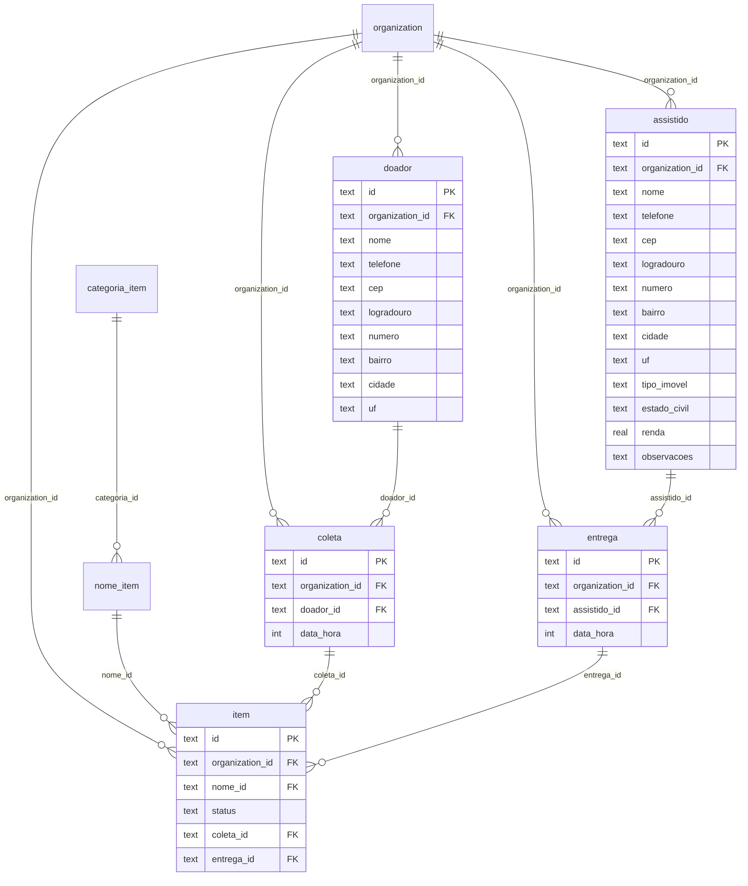

# Modelos do Banco de Dados (D1 + Drizzle ORM)

Este documento descreve o modelo de dados do sistema novo, traduzido do projeto
legado do PI I (Flask + SQLAlchemy + SQLite) e adaptado para a stack atual:
**Cloudflare D1 + Drizzle ORM + Better Auth**.

Fecha a issue #21 e serve de base para a implementação do schema (issue #11).

## Convenções

- Banco: Cloudflare D1 (SQLite). Tipos disponíveis: `text`, `integer`, `real`.
- IDs das tabelas de domínio: `text` (UUID), para ficar consistente com as
  tabelas do Better Auth (`user`, `organization`, `member`, `invitation`), que
  usam IDs em texto.
- **Toda tabela de domínio tem `organization_id`** (multi-tenancy — ver
  `docs/seguranca.md`). Nenhuma query pode ser feita sem esse filtro.
- Booleanos: `integer(..., { mode: "boolean" })` no Drizzle.
- Datas: `integer(..., { mode: "timestamp" })`.
- Enums: `text` com check de valores no código (D1 não tem ENUM nativo).

## Tabelas de autenticação (Better Auth — não criar manualmente)

`user`, `session`, `account`, `organization`, `member` e `invitation` são geradas
pelo Better Auth + plugin Organization. Cada **instituição é uma `organization`**.
O schema completo delas está no guia de migração de auth; no Drizzle a gente só
referencia `organization.id` como FK.

## Tabelas de domínio

### `assistido`

Família/pessoa assistida pela instituição. No legado tinha campos socioeconômicos
detalhados (o diagrama antigo do README estava desatualizado — este é o modelo real).

| Coluna | Tipo | Obs |
|---|---|---|
| `id` | text PK | UUID |
| `organization_id` | text FK → organization.id | **obrigatório** |
| `nome` | text | |
| `telefone` | text | |
| `email` | text | opcional |
| `cep` | text | preenchido via ViaCEP |
| `logradouro` | text | ViaCEP |
| `numero` | text | manual |
| `complemento` | text | opcional |
| `bairro` | text | ViaCEP |
| `cidade` | text | ViaCEP |
| `uf` | text(2) | ViaCEP |
| `tipo_imovel` | text | `ALUGADO` \| `PROPRIO`, opcional |
| `valor_aluguel` | integer | centavos, opcional |
| `estado_civil` | text | `SOLTEIRO` \| `CASADO` \| `DIVORCIADO` \| `VIUVO` \| `UNIAO_ESTAVEL`, opcional |
| `numero_adultos` | integer | opcional |
| `criancas_pequenas` | integer | opcional |
| `adolescentes` | integer | opcional |
| `doentes` | boolean | opcional |
| `bolsa_familia` | boolean | opcional |
| `aposentado` | boolean | opcional |
| `pensao` | boolean | opcional |
| `cesta_basica` | boolean | opcional |
| `atividade_remunerada` | boolean | opcional |
| `renda` | real | opcional |
| `crianca_escola` | boolean | opcional |
| `observacoes` | text | opcional |

> ⚠️ **LGPD:** esta tabela tem dados sensíveis. Nunca usar dados reais em
> desenvolvimento, demos ou vídeos — sempre mock.

### `doador`

| Coluna | Tipo | Obs |
|---|---|---|
| `id` | text PK | |
| `organization_id` | text FK | **obrigatório** |
| `nome` | text | |
| `telefone` | text | |
| `email` | text | opcional |
| endereço | mesmas 7 colunas de endereço do `assistido` | ViaCEP |

### `categoria_item` e `nome_item`

Catálogo de itens (ex.: categoria "Alimento", nome "Arroz 5kg").

| Tabela | Colunas |
|---|---|
| `categoria_item` | `id` text PK, `organization_id` FK, `nome` text |
| `nome_item` | `id` text PK, `organization_id` FK, `categoria_id` FK → categoria_item.id, `nome` text |

### `coleta` e `entrega`

Eventos de doação. `coleta` = doação recebida de um doador;
`entrega` = doação destinada a um assistido.

| Tabela | Colunas |
|---|---|
| `coleta` | `id` text PK, `organization_id` FK, `doador_id` FK → doador.id (opcional), `data_hora` timestamp |
| `entrega` | `id` text PK, `organization_id` FK, `assistido_id` FK → assistido.id (opcional), `data_hora` timestamp |

### `item`

Item concreto que passa pelo estoque. É o coração do rastreio: cada item nasce
numa coleta e termina numa entrega.

| Coluna | Tipo | Obs |
|---|---|---|
| `id` | text PK | |
| `organization_id` | text FK | **obrigatório** |
| `nome_id` | text FK → nome_item.id | |
| `status` | text | `AGUARDA_COLETA` → `EM_ESTOQUE` → `ENTREGUE` |
| `coleta_id` | text FK → coleta.id | preenchido na coleta |
| `doador_id` | text FK → doador.id | denormalizado da coleta, p/ consulta rápida |
| `entrega_id` | text FK → entrega.id | preenchido na entrega |
| `assistido_id` | text FK → assistido.id | denormalizado da entrega |

Regra de negócio do status (vem do legado):

```text
item criado (doação registrada)  → AGUARDA_COLETA
coleta registrada                → EM_ESTOQUE
entrega registrada               → ENTREGUE
```

## Diagrama ER



## Esboço do schema Drizzle (`src/db/schema.ts`)

```typescript
import { sqliteTable, text, integer, real } from "drizzle-orm/sqlite-core";
import { organization } from "./auth-schema"; // gerado pelo Better Auth

const endereco = {
  cep: text("cep"),
  logradouro: text("logradouro"),
  numero: text("numero"),
  complemento: text("complemento"),
  bairro: text("bairro"),
  cidade: text("cidade"),
  uf: text("uf", { length: 2 }),
};

export const assistido = sqliteTable("assistido", {
  id: text("id").primaryKey(),
  organizationId: text("organization_id")
    .notNull()
    .references(() => organization.id),
  nome: text("nome").notNull(),
  telefone: text("telefone"),
  email: text("email"),
  ...endereco,
  tipoImovel: text("tipo_imovel", { enum: ["ALUGADO", "PROPRIO"] }),
  valorAluguel: integer("valor_aluguel"),
  estadoCivil: text("estado_civil", {
    enum: ["SOLTEIRO", "CASADO", "DIVORCIADO", "VIUVO", "UNIAO_ESTAVEL"],
  }),
  numeroAdultos: integer("numero_adultos"),
  criancasPequenas: integer("criancas_pequenas"),
  adolescentes: integer("adolescentes"),
  doentes: integer("doentes", { mode: "boolean" }),
  bolsaFamilia: integer("bolsa_familia", { mode: "boolean" }),
  aposentado: integer("aposentado", { mode: "boolean" }),
  pensao: integer("pensao", { mode: "boolean" }),
  cestaBasica: integer("cesta_basica", { mode: "boolean" }),
  atividadeRemunerada: integer("atividade_remunerada", { mode: "boolean" }),
  renda: real("renda"),
  criancaEscola: integer("crianca_escola", { mode: "boolean" }),
  observacoes: text("observacoes"),
});

export const item = sqliteTable("item", {
  id: text("id").primaryKey(),
  organizationId: text("organization_id")
    .notNull()
    .references(() => organization.id),
  nomeId: text("nome_id").notNull(),
  status: text("status", {
    enum: ["AGUARDA_COLETA", "EM_ESTOQUE", "ENTREGUE"],
  })
    .notNull()
    .default("AGUARDA_COLETA"),
  coletaId: text("coleta_id"),
  entregaId: text("entrega_id"),
  doadorId: text("doador_id"),
  assistidoId: text("assistido_id"),
});

// doador, categoria_item, nome_item, coleta, entrega: mesmo padrão.
```

## Migrations

```bash
npx drizzle-kit generate
wrangler d1 migrations apply sistema-doacoes-db --local   # desenvolvimento
wrangler d1 migrations apply sistema-doacoes-db --remote  # produção
```

## Diferenças em relação ao legado (PI I)

1. **Endereço separado** em 7 colunas (antes era um campo único `endereco`) —
   necessário para a integração com o ViaCEP (issue #16).
2. **`organization_id` em tudo** — o legado tinha `instituicao` como tabela
   comum; agora instituição = `organization` do Better Auth, com isolamento
   obrigatório por tenant.
3. **IDs em texto** em vez de inteiros — padrão do Better Auth.
4. **Sem tabelas `user`/`role` próprias** — autenticação e papéis ficam com o
   Better Auth (`member.role`: owner, admin, staff, viewer).
5. **Sem migração de dados reais** — os dados do legado são fictícios (mock);
   o seed novo pode ser gerado a partir dos JSONs de `mock_data/` do repo antigo.
