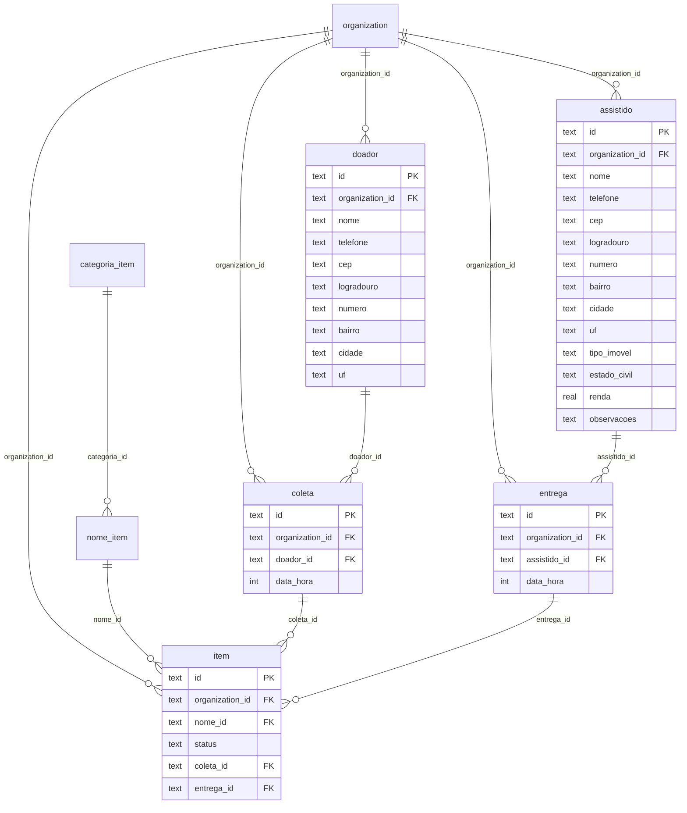

# Modelos do Banco de Dados (D1 + Drizzle ORM)

Este documento descreve o modelo de dados do sistema novo, traduzido do projeto
legado do PI I (Flask + SQLAlchemy + SQLite) e adaptado para a stack atual:
**Cloudflare D1 + Drizzle ORM + Better Auth**.

Fecha a issue #21 e serve de base para a implementação do schema (issue #11).

## Convenções

- Banco: Cloudflare D1 (SQLite). Tipos disponíveis: `text`, `integer`, `real`.
- IDs das tabelas de domínio: `text` (UUID), para ficar consistente com as
  tabelas do Better Auth (`user`, `organization`, `member`, `invitation`), que
  usam IDs em texto.
- **Toda tabela de domínio tem `organization_id`** (multi-tenancy — ver
  `docs/seguranca.md`). Nenhuma query pode ser feita sem esse filtro.
- Booleanos: `integer(..., { mode: "boolean" })` no Drizzle.
- Datas: `integer(..., { mode: "timestamp" })`.
- Enums: `text` com `enum` do Drizzle, que **só tipa o TypeScript** e não emite
  nada no DDL. Como o D1 não tem `ENUM` nativo, cada enum tem um `check()` no
  banco com a mesma lista de valores — é o `check()` que faz o D1 recusar um
  valor fora do domínio. Ver [Integridade no banco](#integridade-no-banco-check).
- `uf` também é um enum (as 27 unidades federativas), não um `text` de 2 letras:
  `text("uf", { length: 2 })` vira `text(2)`, que no SQLite é **afinidade de
  tipo**, não constraint, e o D1 aceitaria `abc`.

## Tabelas de autenticação (Better Auth — não criar manualmente)

`user`, `session`, `account`, `organization`, `member` e `invitation` são geradas
pelo Better Auth + plugin Organization. Cada **instituição é uma `organization`**.
O schema completo delas está no guia de migração de auth; no Drizzle a gente só
referencia `organization.id` como FK.

## Tabelas de domínio

### `assistido`

Família/pessoa assistida pela instituição. No legado tinha campos socioeconômicos
detalhados (o diagrama antigo do README estava desatualizado — este é o modelo real).

| Coluna | Tipo | Obs |
|---|---|---|
| `id` | text PK | UUID |
| `organization_id` | text FK → organization.id | **obrigatório** |
| `nome` | text | |
| `telefone` | text | |
| `email` | text | opcional |
| `cep` | text | preenchido via ViaCEP |
| `logradouro` | text | ViaCEP |
| `numero` | text | manual |
| `complemento` | text | opcional |
| `bairro` | text | ViaCEP |
| `cidade` | text | ViaCEP |
| `uf` | text | sigla de UF, enum das 27, opcional |
| `tipo_imovel` | text | `ALUGADO` \| `PROPRIO`, opcional |
| `valor_aluguel` | integer | centavos, opcional |
| `estado_civil` | text | `SOLTEIRO` \| `CASADO` \| `DIVORCIADO` \| `VIUVO` \| `UNIAO_ESTAVEL`, opcional |
| `numero_adultos` | integer | opcional |
| `criancas_pequenas` | integer | opcional |
| `adolescentes` | integer | opcional |
| `doentes` | boolean | opcional |
| `bolsa_familia` | boolean | opcional |
| `aposentado` | boolean | opcional |
| `pensao` | boolean | opcional |
| `cesta_basica` | boolean | opcional |
| `atividade_remunerada` | boolean | opcional |
| `renda` | real | opcional |
| `crianca_escola` | boolean | opcional |
| `observacoes` | text | opcional |

> ⚠️ **LGPD:** esta tabela tem dados sensíveis. Nunca usar dados reais em
> desenvolvimento, demos ou vídeos — sempre mock.

### `doador`

| Coluna | Tipo | Obs |
|---|---|---|
| `id` | text PK | |
| `organization_id` | text FK | **obrigatório** |
| `nome` | text | |
| `telefone` | text | |
| `email` | text | opcional |
| endereço | mesmas 7 colunas de endereço do `assistido` | ViaCEP |

### `categoria_item` e `nome_item`

Catálogo de itens (ex.: categoria "Alimento", nome "Arroz 5kg").

| Tabela | Colunas |
|---|---|
| `categoria_item` | `id` text PK, `organization_id` FK, `nome` text |
| `nome_item` | `id` text PK, `organization_id` FK, `categoria_id` FK → categoria_item.id, `nome` text |

### `coleta` e `entrega`

Eventos de doação. `coleta` = doação recebida de um doador;
`entrega` = doação destinada a um assistido.

| Tabela | Colunas |
|---|---|
| `coleta` | `id` text PK, `organization_id` FK, `doador_id` FK → doador.id (**obrigatório**), `data_hora` timestamp |
| `entrega` | `id` text PK, `organization_id` FK, `assistido_id` FK → assistido.id (**obrigatório**), `data_hora` timestamp |

Sem doador ou sem assistido o evento não existe: uma coleta órfã não diz de quem
foi a doação, e uma entrega órfã não diz para quem foi.

### `item`

Item concreto que passa pelo estoque. É o coração do rastreio: cada item nasce
numa coleta e termina numa entrega.

| Coluna | Tipo | Obs |
|---|---|---|
| `id` | text PK | |
| `organization_id` | text FK | **obrigatório** |
| `nome_id` | text FK → nome_item.id | |
| `status` | text | `AGUARDA_COLETA` → `EM_ESTOQUE` → `ENTREGUE` |
| `coleta_id` | text FK → coleta.id | preenchido na coleta |
| `entrega_id` | text FK → entrega.id | preenchido na entrega |

Quem doou e quem recebeu **não** são colunas do `item`: saem da coleta e da
entrega (`item → coleta → doador`, `item → entrega → assistido`). Antes havia
uma cópia denormalizada de cada lado, e elas divergiam do evento de origem — nos
dados de mock, 12 dos 44 itens discordavam sobre o destinatário. Para listar
"itens recebidos por um assistido" a consulta faz o join pelas duas tabelas.

Regra de negócio do status (vem do legado):

```text
item criado (doação registrada)  → AGUARDA_COLETA
coleta registrada                → EM_ESTOQUE
entrega registrada               → ENTREGUE
```

## Integridade no banco (CHECK)

Regras que hoje só existiriam na aplicação estão como `check()` em
`src/worker/db/schema.ts`, então valem para **qualquer escrita**: API, D1 Studio,
`npm run db-seed` e scripts futuros. Faz parte da issue
[#43](https://github.com/luiztosk/sistema-doacoes-2/issues/43).

O que o Drizzle emite e o que não emite importa para não confiar no schema duas
vezes:

| No schema | No DDL | No tipo |
|---|---|---|
| `text("status", { enum: [...] })` | nada | `z.enum([...])` no zod |
| `text("uf", { length: 2 })` | `text(2)` — afinidade, não constraint | `z.string()` |
| `check("nome", ...)` | `CONSTRAINT ... CHECK (...)`, avaliado a cada escrita | não aparece no zod |

### O que está garantido

| Constraint | Tabela | Regra |
|---|---|---|
| `*_nome_nao_vazio` | `assistido`, `doador`, `categoria_item`, `nome_item` | `length(trim(nome)) > 0` |
| `*_cep_formato` | `assistido`, `doador` | 8 dígitos, sem hífen (é o que o ViaCEP devolve) |
| `*_uf_valida` | `assistido`, `doador` | uma das 27 UFs |
| `assistido_tipo_imovel_valido` | `assistido` | `ALUGADO` \| `PROPRIO` |
| `assistido_estado_civil_valido` | `assistido` | um dos 5 estados civis |
| `assistido_renda_nao_negativa` | `assistido` | `renda >= 0` |
| `assistido_valor_aluguel_nao_negativo` | `assistido` | `valor_aluguel >= 0` |
| `assistido_valor_aluguel_compatipo_imovel` | `assistido` | aluguel > 0 se `ALUGADO`, vazio se `PROPRIO` |
| `assistido_*_nao_negativo` | `assistido` | contadores de pessoas ≥ 0 |
| `assistido_*_valido` | `assistido` | um `check()` por coluna booleana, `IN (0, 1)` |
| `item_status_valido` | `item` | um dos 3 status |
| `item_entregue_exige_entrega` | `item` | `ENTREGUE` ⇒ `entrega_id` preenchido |
| `item_entrega_exige_coleta` | `item` | `entrega_id` preenchido ⇒ `coleta_id` preenchido |

Um `check()` por coluna booleana, e não um combinado, porque o nome da constraint
aparece na mensagem do D1 (`CHECK constraint failed: assistido_doentes_valido`) e
é ele que permite transformar erro de banco em erro de campo na API.

`NULL` passa em qualquer `CHECK` — a expressão dá `NULL`, não `FALSE`, e o SQLite
só reprova em `FALSE` — então uma coluna opcional não precisa de `IS NOT NULL AND`
para "deixar passar o vazio".

### Índices e `ON DELETE`

As tabelas de domínio não tinham índice nenhum além da PK, e o SQLite não cria
índice automático para FK. Hoje existem `nome_item_categoriaId_idx`,
`coleta_doadorId_idx`, `entrega_assistidoId_idx`, `item_status_idx`,
`item_coletaId_idx` e `item_entregaId_idx` — as colunas que filtram as telas de
lista. Quando a [#13](https://github.com/luiztosk/sistema-doacoes-2/issues/13)
entrar, o índice tem que começar por `organization_id`.

As 5 FKs de domínio declaram `on delete: "no action"` explicitamente: excluir um
doador que tem coleta estoura, e a API responde `409`. Está escrito assim de
propósito, para não ficar implícito.

O catálogo também tem unicidade: `categoria_item_nome_uniq` e
`nome_item_nome_uniq`, os dois sobre `lower(nome)`, para que "arroz 5kg" e
"Arroz 5kg" contem como o mesmo nome. Um `UNIQUE` na coluna seria case-sensitive
(a collation padrão do SQLite é BINARY) e é constraint de tabela — que o SQLite
só consegue adicionar reconstruindo a tabela. Um índice sobre `lower(nome)` é um
`CREATE UNIQUE INDEX` e não mexe nos dados. ⚠️ O seed usa
`onConflictDoNothing()`, então um CSV com nome repetido vira linha pulada em
silêncio: o banco recusa, o seed não avisa.

### Triggers: não adicionados

Decisão registrada, não omissão. Os triggers foram avaliados e descartados:

- **Transição de status** (`AGUARDA_COLETA → EM_ESTOQUE → ENTREGUE`) já é
  validada em `validateItem` (`src/worker/api/resources.ts`), que responde `400`
  com o campo e a transição inválida. Um trigger seria uma segunda cópia
  independente da mesma regra, e o D1 levantaria a violação como erro de
  constraint genérico — resposta pior do que a de hoje, para o cliente.
- **As duas invariantes** (`item_entregue_exige_entrega` e
  `item_entrega_exige_coleta`) já são `check()`, e as duas tabelas do banco estão
  com zero violação. Um trigger cobriria o mesmo chão com um erro pior.
- Uma das duas invariantes com dados sujos deixou de existir como possibilidade:
  o destinatário vinha de uma coluna denormalizada no `item` que podia divergir
  da entrega (12 dos 44 itens divergiam). Com a coluna removida, o destinatário
  só tem uma fonte.

Se um dia o `db-seed` ou um script escrever direto no D1 precisar da transição de
status, o lugar certo é um trigger — e ele entra junto com um mapeamento de
erro, não sozinho.

### Pendente

- **Valores no zod.** `createInsertSchema` (issue
  [#42](https://github.com/luiztosk/sistema-doacoes-2/issues/42)) infere de graça
  o que o schema já expressa — enum, boolean, required. O que precisa de
  `refinement` é o que o `check()` expressa e o tipo não: `>= 0`, texto não
  vazio, formato de CEP. Regra que precisa estar documentada na API tem que
  existir nos dois lados.
- **Erro de banco → erro de API.** Hoje `handleApiError`
  (`src/worker/api/errors.ts`) trata constraint, FK e unique com o mesmo regex e
  responde `409 CONFLICT`. CHECK é outra coisa: o cliente mandou valor inválido, e
  isso é `400`. A mensagem do D1 traz o nome da constraint, então dá para mapear
  constraint → campo e responder `400 INVALID_VALUE` com o nome do campo,
  deixando `409` só para FK e unique.

## Diagrama ER


```mermaid
erDiagram
  organization ||--o{ assistido : organization_id
  organization ||--o{ doador : organization_id
  organization ||--o{ coleta : organization_id
  organization ||--o{ entrega : organization_id
  organization ||--o{ item : organization_id
  categoria_item ||--o{ nome_item : categoria_id
  nome_item ||--o{ item : nome_id
  doador ||--o{ coleta : doador_id
  assistido ||--o{ entrega : assistido_id
  coleta ||--o{ item : coleta_id
  entrega ||--o{ item : entrega_id

  assistido {
    text id PK
    text organization_id FK
    text nome
    text telefone
    text cep
    text logradouro
    text numero
    text bairro
    text cidade
    text uf
    text tipo_imovel
    text estado_civil
    real renda
    text observacoes
  }

  doador {
    text id PK
    text organization_id FK
    text nome
    text telefone
    text cep
    text logradouro
    text numero
    text bairro
    text cidade
    text uf
  }

  item {
    text id PK
    text organization_id FK
    text nome_id FK
    text status
    text coleta_id FK
    text entrega_id FK
  }

  coleta {
    text id PK
    text organization_id FK
    text doador_id FK
    int data_hora
  }

  entrega {
    text id PK
    text organization_id FK
    text assistido_id FK
    int data_hora
  }
```

## Esboço do schema Drizzle (`src/db/schema.ts`)

```typescript
import { sqliteTable, text, integer, real } from "drizzle-orm/sqlite-core";
import { organization } from "./auth-schema"; // gerado pelo Better Auth

const UFS = [
  "AC","AL","AP","AM","BA","CE","DF","ES","GO","MA","MT","MS","MG",
  "PA","PB","PR","PE","PI","RJ","RN","RS","RO","RR","SC","SP","SE","TO",
] as const;

const endereco = {
  cep: text("cep"),
  logradouro: text("logradouro"),
  numero: text("numero"),
  complemento: text("complemento"),
  bairro: text("bairro"),
  cidade: text("cidade"),
  uf: text("uf", { enum: UFS }),
};

export const assistido = sqliteTable("assistido", {
  id: text("id").primaryKey(),
  organizationId: text("organization_id")
    .notNull()
    .references(() => organization.id),
  nome: text("nome").notNull(),
  telefone: text("telefone"),
  email: text("email"),
  ...endereco,
  tipoImovel: text("tipo_imovel", { enum: ["ALUGADO", "PROPRIO"] }),
  valorAluguel: integer("valor_aluguel"),
  estadoCivil: text("estado_civil", {
    enum: ["SOLTEIRO", "CASADO", "DIVORCIADO", "VIUVO", "UNIAO_ESTAVEL"],
  }),
  numeroAdultos: integer("numero_adultos"),
  criancasPequenas: integer("criancas_pequenas"),
  adolescentes: integer("adolescentes"),
  doentes: integer("doentes", { mode: "boolean" }),
  bolsaFamilia: integer("bolsa_familia", { mode: "boolean" }),
  aposentado: integer("aposentado", { mode: "boolean" }),
  pensao: integer("pensao", { mode: "boolean" }),
  cestaBasica: integer("cesta_basica", { mode: "boolean" }),
  atividadeRemunerada: integer("atividade_remunerada", { mode: "boolean" }),
  renda: real("renda"),
  criancaEscola: integer("crianca_escola", { mode: "boolean" }),
  observacoes: text("observacoes"),
});

export const item = sqliteTable("item", {
  id: text("id").primaryKey(),
  organizationId: text("organization_id")
    .notNull()
    .references(() => organization.id),
  nomeId: text("nome_id").notNull(),
  status: text("status", {
    enum: ["AGUARDA_COLETA", "EM_ESTOQUE", "ENTREGUE"],
  })
    .notNull()
    .default("AGUARDA_COLETA"),
  coletaId: text("coleta_id"),
  entregaId: text("entrega_id"),
});

// doador, categoria_item, nome_item, coleta, entrega: mesmo padrão.
```

O esboço acima omite os `check()` e os `index()` das tabelas, que só existem
depois da issue #43 — o arquivo real é `src/worker/db/schema.ts`.

## Migrations

```bash
npx drizzle-kit generate
wrangler d1 migrations apply sistema-doacoes-db --local   # desenvolvimento
wrangler d1 migrations apply sistema-doacoes-db --remote  # produção
```

## Diferenças em relação ao legado (PI I)

1. **Endereço separado** em 7 colunas (antes era um campo único `endereco`) —
   necessário para a integração com o ViaCEP (issue #16).
2. **`organization_id` em tudo** — o legado tinha `instituicao` como tabela
   comum; agora instituição = `organization` do Better Auth, com isolamento
   obrigatório por tenant.
3. **IDs em texto** em vez de inteiros — padrão do Better Auth.
4. **Sem tabelas `user`/`role` próprias** — autenticação e papéis ficam com o
   Better Auth (`member.role`: owner, admin, staff, viewer).
5. **Sem migração de dados reais** — os dados do legado são fictícios (mock);
   o seed novo pode ser gerado a partir dos JSONs de `mock_data/` do repo antigo.
6. **`item` sem `doador_id`/`assistido_id`** — o legado guardava uma cópia
   denormalizada do doador e do assistido no item. Quem doou e quem recebeu saem
   da coleta e da entrega; a cópia divergia do evento de origem.
