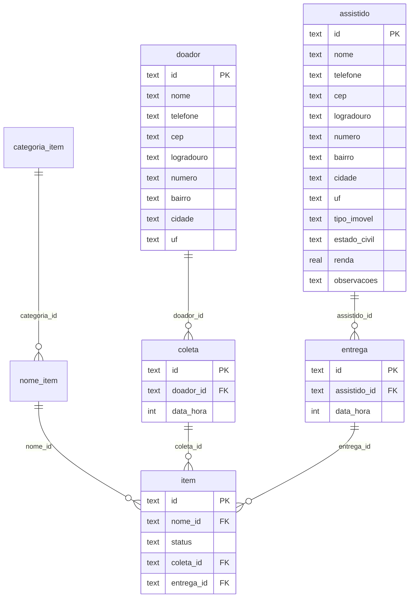

# Modelos do Banco de Dados (D1 + Drizzle ORM)

> ⚠️ **O schema e o banco divergem em um ponto.** Existem **26 `check()` no banco**
> que **não estão mais** no `schema.ts` (removidos em `efca2a7`). As duas
> migrations existentes são `20260926213838_lucky_karma` (baseline, com os 26
> `check()`) e `20260926230000_sleepy_green_goblin` (dois `CREATE UNIQUE INDEX`).
> **Decisão:** em vez de escrever a migration que os derruba, o banco local e o
> remoto serão recriados do zero — `npm run local-db-init` a partir de um estado
> vazio, gerando as migrations de um schema novo e semeando em cima. Enquanto os
> `check()` existirem no banco, uma escrita rejeitada por eles volta como
> `500 INTERNAL_ERROR` em vez de um erro de validação — ver
> [Os `check()` foram removidos](#os-checks-foram-removidos).

Este documento descreve o modelo de dados do sistema novo, traduzido do projeto
legado do PI I (Flask + SQLAlchemy + SQLite) e adaptado para a stack atual:
**Cloudflare D1 + Drizzle ORM + Better Auth**.

Fecha a issue #21 e serve de base para a implementação do schema (issue #11).

## Convenções

- Banco: Cloudflare D1 (SQLite). Tipos disponíveis: `text`, `integer`, `real`.
- IDs das tabelas de domínio: `text` (UUID), para ficar consistente com as
  tabelas do Better Auth (`user`, `organization`, `member`, `invitation`), que
  usam IDs em texto.
- **Nenhuma tabela de domínio tem `organization_id`.** A coluna existiu e foi
  removida junto com a integração do Better Auth; volta com a
  [#13](https://github.com/luiztosk/sistema-doacoes-2/issues/13). Até lá nenhuma
  query filtra por instituição, e a API **não deve ser exposta com dados reais**
  — ver [`api.md`](./api.md) e [`seguranca.md`](./seguranca.md).
- Booleanos: `integer(..., { mode: "boolean" })` no Drizzle.
- Datas: `integer(..., { mode: "timestamp" })`.
- Enums: `text` com `enum` do Drizzle, que **só tipa o TypeScript** e não emite
  nada no DDL. A lista é a mesma que o zod recebe como `z.enum`, então o domínio
  é recusado na entrada da API e o banco aceita qualquer texto. Ver
  [Regras de valor](#regras-de-valor).
- `uf` também é um enum (as 27 unidades federativas), não um `text` de 2 letras:
  `text("uf", { length: 2 })` vira `text(2)`, que no SQLite é **afinidade de
  tipo**, não constraint, e o D1 aceitaria `abc`.

## Tabelas de autenticação (Better Auth — não criar manualmente)

`user`, `session`, `account`, `organization`, `member`, `invitation` e
`verification` são geradas pelo Better Auth + plugin Organization. Cada
**instituição é uma `organization`**. Hoje nenhuma tabela de domínio referencia
`organization.id` — a coluna que faria essa ligação foi removida
([#13](https://github.com/luiztosk/sistema-doacoes-2/issues/13)).

## Tabelas de domínio

### `assistido`

Família/pessoa assistida pela instituição. No legado tinha campos socioeconômicos
detalhados (o diagrama antigo do README estava desatualizado — este é o modelo real).

| Coluna | Tipo | Obs |
|---|---|---|
| `id` | text PK | UUID |
| `nome` | text | |
| `telefone` | text | |
| `email` | text | opcional |
| `cep` | text | preenchido via ViaCEP |
| `logradouro` | text | ViaCEP |
| `numero` | text | manual |
| `complemento` | text | opcional |
| `bairro` | text | ViaCEP |
| `cidade` | text | ViaCEP |
| `uf` | text | sigla de UF, enum das 27, opcional |
| `tipo_imovel` | text | `ALUGADO` \| `PROPRIO`, opcional |
| `valor_aluguel` | integer | centavos, opcional |
| `estado_civil` | text | `SOLTEIRO` \| `CASADO` \| `DIVORCIADO` \| `VIUVO` \| `UNIAO_ESTAVEL`, opcional |
| `numero_adultos` | integer | opcional |
| `criancas_pequenas` | integer | opcional |
| `adolescentes` | integer | opcional |
| `doentes` | boolean | opcional |
| `bolsa_familia` | boolean | opcional |
| `aposentado` | boolean | opcional |
| `pensao` | boolean | opcional |
| `cesta_basica` | boolean | opcional |
| `atividade_remunerada` | boolean | opcional |
| `renda` | real | opcional |
| `crianca_escola` | boolean | opcional |
| `observacoes` | text | opcional |

> ⚠️ **LGPD:** esta tabela tem dados sensíveis. Nunca usar dados reais em
> desenvolvimento, demos ou vídeos — sempre mock.

### `doador`

| Coluna | Tipo | Obs |
|---|---|---|
| `id` | text PK | |
| `nome` | text | |
| `telefone` | text | |
| `email` | text | opcional |
| endereço | mesmas 7 colunas de endereço do `assistido` | ViaCEP |

### `categoria_item` e `nome_item`

Catálogo de itens (ex.: categoria "Alimento", nome "Arroz 5kg").

| Tabela | Colunas |
|---|---|
| `categoria_item` | `id` text PK, `nome` text |
| `nome_item` | `id` text PK, `categoria_id` FK → categoria_item.id, `nome` text |

### `coleta` e `entrega`

Eventos de doação. `coleta` = doação recebida de um doador;
`entrega` = doação destinada a um assistido.

| Tabela | Colunas |
|---|---|
| `coleta` | `id` text PK, `doador_id` FK → doador.id (**obrigatório**), `data_hora` timestamp |
| `entrega` | `id` text PK, `assistido_id` FK → assistido.id (**obrigatório**), `data_hora` timestamp |

Sem doador ou sem assistido o evento não existe: uma coleta órfã não diz de quem
foi a doação, e uma entrega órfã não diz para quem foi.

### `item`

Item concreto que passa pelo estoque. É o coração do rastreio: cada item nasce
numa coleta e termina numa entrega.

| Coluna | Tipo | Obs |
|---|---|---|
| `id` | text PK | |
| `nome_id` | text FK → nome_item.id | **obrigatório** |
| `status` | text | `AGUARDA_COLETA` → `EM_ESTOQUE` → `ENTREGUE`, `NOT NULL`, default `AGUARDA_COLETA` |
| `coleta_id` | text FK → coleta.id | preenchido na coleta |
| `entrega_id` | text FK → entrega.id | preenchido na entrega |

Quem doou e quem recebeu **não** são colunas do `item`: saem da coleta e da
entrega (`item → coleta → doador`, `item → entrega → assistido`). Antes havia
uma cópia denormalizada de cada lado, e elas divergiam do evento de origem — nos
dados de mock, 12 dos 44 itens discordavam sobre o destinatário. Para listar
"itens recebidos por um assistido" a consulta faz o join pelas duas tabelas.

Regra de negócio do status (vem do legado):

```text
item criado (doação registrada)  → AGUARDA_COLETA
coleta registrada                → EM_ESTOQUE
entrega registrada               → ENTREGUE
```

## Regras de valor

As regras moram em um lugar só: o zod de `src/worker/db/schema.ts`, cada
`refinement` logo abaixo da tabela que ele julga. As regras viram `400` com o nome
do campo, não `409` do banco.

### Os `check()` foram removidos

O schema **teve** `check()` — 26 deles, em `efca2a7` — e não tem mais. A decisão
foi o contrário da intuição, e vale registrar o porquê:

- **A regra duplicada tem dois jeitos de falhar.** No `check()` a violação sobe
  como `500 INTERNAL_ERROR` — `handleApiError` só traduz `FOREIGN KEY` e
  `UNIQUE constraint`, então um `CHECK constraint failed` cai no `catch` genérico
  e o cliente recebe um erro interno, sem mensagem útil. No zod a mesma regra
  volta como `400 INVALID_VALUE` com o campo nomeado. Duas cópias da regra, dois
  formatos de erro, e o pior dos dois chegando ao cliente.
- **O zod já cobria tudo que a API consegue julgar.** Nome em branco, `>= 0`,
  formato de CEP, as listas de `enum` e a regra entre `tipoImovel` e
  `valorAluguel` estão todas no `refinement`, com a mensagem escrita para o
  usuário final.
- **O que o zod não alcança, o banco continua fazendo.** A `FOREIGN KEY` e o
  índice único do catálogo são constraints de verdade — não há como reescrevê-las
  em TypeScript — e continuam no DDL. Referência e unicidade não foram
  removidas: só deixaram de ter uma segunda cópia em `check()`.

O preço, aceito: **escrita que não passa pela API não é filtrada.** D1 Studio,
`npm run db-seed` e scripts futuros podem gravar `renda: -500` ou nome em branco
sem que nada recuse. E o `PATCH` tem duas brechas, que o `check()` cobria e o zod
não cobriu — ver [Onde não há garantia](#onde-não-há-garantia).

Uma consequência prática: `drizzle/migrations/20260926213838_lucky_karma`
ainda cria as constraints, porque uma migration já aplicada é imutável. O banco
local e o remoto já têm os `check()`, e um banco novo criado do zero também os
terá, até alguém rodar `npm run gen-drizzle` e `wrangler d1 migrations apply`
para a migration que os remove. O Drizzle não percebe isso sozinho: ele só vê a
diferença quando alguém manda gerar.

O que o Drizzle emite e o que não emite importa para não confiar no schema duas
vezes:

| No schema | No DDL | No zod |
|---|---|---|
| `text("status", { enum: [...] })` | nada | `z.enum([...])` |
| `text("uf", { enum: UFS })` | nada — só tipa o TS | `z.enum(UFS)` |
| `integer("aposentado", { mode: "boolean" })` | `integer` | `z.boolean()` |
| `text("doador_id").references(doador.id)` | `FOREIGN KEY` | nada — e é o banco quem julga |

### O que é garantido

| Regra | Tabela | Onde |
|---|---|---|
| `nome` não vazio (`length(trim(nome)) > 0`) | `assistido`, `doador`, `categoria_item`, `nome_item` | `nomeNaoVazio` |
| `cep` com 8 dígitos, sem hífen (é o que o ViaCEP devolve) | `assistido`, `doador` | `cepDeEntrada`, `cepGuardado` |
| uma das 27 UFs | `assistido`, `doador` | `enum` da coluna |
| `ALUGADO` \| `PROPRIO` | `assistido` | `enum` da coluna |
| um dos 5 estados civis | `assistido` | `enum` da coluna |
| `renda >= 0` | `assistido` | `naoNegativo` |
| `valorAluguel >= 0` | `assistido` | `naoNegativo` |
| aluguel > 0 se `ALUGADO`, vazio se `PROPRIO` | `assistido` | `compatAluguelImovel` |
| contadores de pessoas ≥ 0 | `assistido` | `naoNegativo` |
| um dos 3 status | `item` | `enum` da coluna |
| referência existe (doador, assistido, coleta, entrega, nome de item) | todas | `FOREIGN KEY` do D1, mapeado em `handleApiError` |
| `ENTREGUE` ⇒ `entregaId` preenchido | `item` | `validateItem` (`DELIVERY_REQUIRED`) |
| `AGUARDA_COLETA → EM_ESTOQUE → ENTREGUE` | `item` | `validateItem` (`INVALID_STATUS_TRANSITION`) |

Referência é o único caso em que o banco é o juiz, e é de graça: o D1 já
recusa a escrita pendurada, então a API não consulta nada antes de inserir. O
erro sobe como `D1QueryError`/`DrizzleQueryError` com o texto
`FOREIGN KEY constraint failed` na cadeia, e `handleApiError` o traduz —
`400 INVALID_REFERENCE` em `POST`/`PATCH`, `409 CONFLICT` em `DELETE`. O texto
do D1 não diz qual das seis chaves falhou, então a mensagem é genérica: uma
consulta antes da escrita traria o nome do campo, ao custo de uma leitura por
payload.

### Onde não há garantia

Duas regras tinham `check()` e foram removidos com ele. O `PATCH` não consegue
julgar nenhuma das duas, porque o campo que decide é justamente o que o cliente
não mandou:

- `tipoImovel` × `valorAluguel`: `POST {"tipoImovel":"ALUGADO"}` sem
  `valorAluguel` é recusado, e `PATCH {"tipoImovel":"ALUGADO"}` sem
  `valorAluguel` é aceito. O `UpdateSchema` só julga o par quando o próprio
  pedido traz os dois campos.
- `entregaId` ⇒ `coletaId`: um item pode ficar apontando para uma entrega sem
  coleta, o que desfaz a fonte única de quem doou (ver
  [`item`](#item)). A `FOREIGN KEY` garante que a coleta existe, não que ela
  esteja lá.

Fechar qualquer uma das duas é uma linha em `validateAssistido`/`validateItem`:
o `validate` do `registerResource` já recebe a linha existente, que é o que
falta.

### Índices e `ON DELETE`

As tabelas de domínio não tinham índice nenhum além da PK, e o SQLite não cria
índice automático para FK. Hoje existem `nome_item_categoriaId_idx`,
`coleta_doadorId_idx`, `entrega_assistidoId_idx`, `item_status_idx`,
`item_coletaId_idx` e `item_entregaId_idx` — as colunas que filtram as telas de
lista. Quando a [#13](https://github.com/luiztosk/sistema-doacoes-2/issues/13)
entrar, o índice tem que começar por `organization_id`.

As 6 FKs de domínio declaram `on delete: "no action"` explicitamente: excluir um
doador que tem coleta estoura, e a API responde `409`. A mesma constraint é o que
recusa um `doador_id` que não existe, então é a única regra que o banco julga —
ver [Regras de valor](#regras-de-valor). Está escrito assim de propósito, para
não ficar implícito.

> A migration já aplicada (`20260926213838_lucky_karma`) **não emite** cláusula
> `ON DELETE` para as FKs de domínio — só para as do Better Auth, que usam
> `CASCADE`. Como migration é imutável, "não implícito" vale para o TypeScript e
> para o `snapshot.json`, mas no banco o comportamento é o default do SQLite.

O catálogo também tem unicidade: `categoria_item_nome_uniq` e
`nome_item_nome_uniq`, os dois sobre `lower(nome)`, para que "arroz 5kg" e
"Arroz 5kg" contem como o mesmo nome. Um `UNIQUE` na coluna seria case-sensitive
(a collation padrão do SQLite é BINARY) e é constraint de tabela — que o SQLite
só consegue adicionar reconstruindo a tabela. Um índice sobre `lower(nome)` é um
`CREATE UNIQUE INDEX` e não mexe nos dados. ⚠️ O seed usa
`onConflictDoNothing()`, então um CSV com nome repetido vira linha pulada em
silêncio: o banco recusa, o seed não avisa.

### Triggers: não adicionados

Decisão registrada, não omissão. Os triggers foram avaliados e descartados:

- **Transição de status** (`AGUARDA_COLETA → EM_ESTOQUE → ENTREGUE`) já é
  validada em `validateItem` (`src/worker/api/v1.ts`), que responde `400`
  com o campo e a transição inválida. Um trigger seria uma segunda cópia
  independente da mesma regra, e o D1 levantaria a violação como erro de
  constraint genérico — resposta pior do que a de hoje, para o cliente.
- **Regras de valor** (`nome` em branco, `renda` negativa, `cep` fora de 8
  dígitos) dariam ao cliente exatamente a resposta que o trigger liftaria:
  `409` genérico, sem o campo. É a mesma razão que tirou o `check()` do schema —
  ver [Os `check()` foram removidos](#os-check-foram-removidos).
- **Uma das invariantes com dados sujos deixou de existir como possibilidade:**
  o destinatário vinha de uma coluna denormalizada no `item` que podia divergir
  da entrega (12 dos 44 itens divergiam). Com a coluna removida, o destinatário
  só tem uma fonte.

Se um dia o `db-seed` ou um script escrever direto no D1 precisar de uma regra
que o zod não alcança, o lugar certo é um trigger — e ele entra junto com um
mapeamento de erro, não sozinho.

### Pendente

- **Recriar as invariantes no `PATCH`.** As duas brechas que o `check()`
  cobria, ver [Onde não há garantia](#onde-não-há-garantia).
- **Nome do campo na `INVALID_REFERENCE`.** O texto do D1 não diz qual das cinco
  chaves falhou, então a mensagem é genérica. Nomear exigiria voltar a consultar
  antes de escrever — que é o que o `FOREIGN KEY` eliminou de graça.
- **A migration que remove os `check()`.** `npm run gen-drizzle` ainda não foi
  rodado depois da remoção, então o banco continua com eles. Ver [Os `check()`
  foram removidos](#os-check-foram-removidos).

### Feito: valores no zod

`createInsertSchema` da
[#42](https://github.com/luiztosk/sistema-doacoes-2/issues/42) infere de graça o
que a tabela já expressa — enum, boolean, required. O `refinement` cobre o que o
tipo não diz: `>= 0`, texto não vazio, formato de CEP, e a regra entre
`tipoImovel` e `valorAluguel`. Está em `src/worker/db/schema.ts`, cada
`refinement` logo abaixo da tabela que ele julga, ao lado dos três schemas que o
consumem — sem `check()` no banco e sem schema factory.

## Diagrama ER


```mermaid
erDiagram
  categoria_item ||--o{ nome_item : categoria_id
  nome_item ||--o{ item : nome_id
  doador ||--o{ coleta : doador_id
  assistido ||--o{ entrega : assistido_id
  coleta ||--o{ item : coleta_id
  entrega ||--o{ item : entrega_id

  assistido {
    text id PK
    text nome
    text telefone
    text cep
    text logradouro
    text numero
    text bairro
    text cidade
    text uf
    text tipo_imovel
    text estado_civil
    real renda
    text observacoes
  }

  doador {
    text id PK
    text nome
    text telefone
    text cep
    text logradouro
    text numero
    text bairro
    text cidade
    text uf
  }

  item {
    text id PK
    text nome_id FK
    text status
    text coleta_id FK
    text entrega_id FK
  }

  coleta {
    text id PK
    text doador_id FK
    int data_hora
  }

  entrega {
    text id PK
    text assistido_id FK
    int data_hora
  }
```

## Esboço do schema Drizzle (`src/worker/db/schema.ts`)

```typescript
import { sqliteTable, text, integer, real } from "drizzle-orm/sqlite-core";

const UFS = [
  "AC","AL","AP","AM","BA","CE","DF","ES","GO","MA","MT","MS","MG",
  "PA","PB","PR","PE","PI","RJ","RN","RS","RO","RR","SC","SP","SE","TO",
] as const;

const endereco = {
  cep: text("cep"),
  logradouro: text("logradouro"),
  numero: text("numero"),
  complemento: text("complemento"),
  bairro: text("bairro"),
  cidade: text("cidade"),
  uf: text("uf", { enum: UFS }),
};

export const assistido = sqliteTable("assistido", {
  id: text("id").primaryKey(),
  nome: text("nome").notNull(),
  telefone: text("telefone"),
  email: text("email"),
  ...endereco,
  tipoImovel: text("tipo_imovel", { enum: ["ALUGADO", "PROPRIO"] }),
  valorAluguel: integer("valor_aluguel"),
  estadoCivil: text("estado_civil", {
    enum: ["SOLTEIRO", "CASADO", "DIVORCIADO", "VIUVO", "UNIAO_ESTAVEL"],
  }),
  numeroAdultos: integer("numero_adultos"),
  criancasPequenas: integer("criancas_pequenas"),
  adolescentes: integer("adolescentes"),
  doentes: integer("doentes", { mode: "boolean" }),
  bolsaFamilia: integer("bolsa_familia", { mode: "boolean" }),
  aposentado: integer("aposentado", { mode: "boolean" }),
  pensao: integer("pensao", { mode: "boolean" }),
  cestaBasica: integer("cesta_basica", { mode: "boolean" }),
  atividadeRemunerada: integer("atividade_remunerada", { mode: "boolean" }),
  renda: real("renda"),
  criancaEscola: integer("crianca_escola", { mode: "boolean" }),
  observacoes: text("observacoes"),
});

export const item = sqliteTable("item", {
  id: text("id").primaryKey(),
  nomeId: text("nome_id").notNull(),
  status: text("status", {
    enum: ["AGUARDA_COLETA", "EM_ESTOQUE", "ENTREGUE"],
  })
    .notNull()
    .default("AGUARDA_COLETA"),
  coletaId: text("coleta_id"),
  entregaId: text("entrega_id"),
});

// doador, categoria_item, nome_item, coleta, entrega: mesmo padrão.
```

O esboço acima omite os `index()` das tabelas e os schemas de zod que julgam
cada uma — o arquivo real é `src/worker/db/schema.ts`.

## Migrations

```bash
npx drizzle-kit generate                                        # gera a migration
wrangler d1 migrations apply prod-sistema-doacoes-2 --local    # desenvolvimento
wrangler d1 migrations apply prod-sistema-doacoes-2 --remote   # produção
```

Detalhes em [`drizzle-migrations.md`](./drizzle-migrations.md).

## Diferenças em relação ao legado (PI I)

1. **Endereço separado** em 7 colunas (antes era um campo único `endereco`) —
   necessário para a integração com o ViaCEP (issue #16).
2. **Instituição = `organization` do Better Auth, mas sem isolamento ainda** —
   o legado tinha `instituicao` como tabela comum. A coluna `organization_id`
   existia em todas as tabelas de domínio e foi removida junto com a integração
   do Better Auth; volta com a
   [#13](https://github.com/luiztosk/sistema-doacoes-2/issues/13). **Enquanto ela
   não voltar, não há isolamento por tenant.**
3. **IDs em texto** em vez de inteiros — padrão do Better Auth.
4. **Sem tabelas `user`/`role` próprias** — autenticação fica com o Better Auth.
   O papel vive em `member.role`, que é um `text` sem constraint com default
   `'member'`; os valores usuais do Better Auth são `owner`, `admin` e `member`.
5. **Sem migração de dados reais** — os dados do legado são fictícios (mock);
   o seed novo pode ser gerado a partir dos JSONs de `mock_data/` do repo antigo.
6. **`item` sem `doador_id`/`assistido_id`** — o legado guardava uma cópia
   denormalizada do doador e do assistido no item. Quem doou e quem recebeu saem
   da coleta e da entrega; a cópia divergia do evento de origem.
